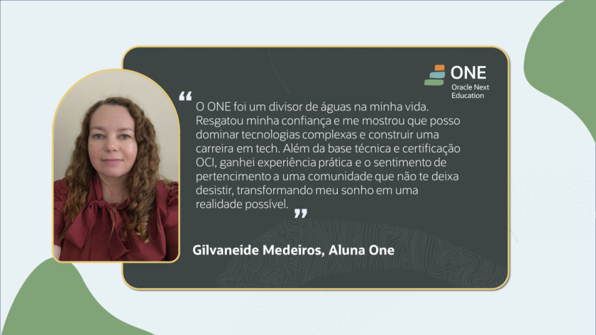

# 👋 Olá! Sou a Gilvaneide (Gil)

### 🌟 Porta-voz do Programa ONE (Oracle Next Education) | Desenvolvedora Back-end Java | AlumniONE

  

Sou uma entusiasta da tecnologia em transição de carreira, com mais de 12 anos de experiência em gestão administrativa e agora focada em construir soluções robustas no Back-end. Minha trajetória de 365 dias no Programa ONE me transformou em uma profissional resiliente, certificada e apaixonada por Cloud e Java.

---

## 🚀 Destaques e Conquistas Recentes
- **📢 Porta-voz Oracle/Alura:** Selecionada para representar o programa ONE em campanhas oficiais devido ao meu desempenho e história de superação.
- **🏆 Top 20 Hackathon ONE:** Entre 40 projetos, minha equipe conquistou uma posição de destaque, aplicando OCI e Java na prática.
- **☁️ Certified OCI Foundations Associate:** Especialista certificada em fundamentos de Oracle Cloud Infrastructure.
- **🎓 AlumniONE:** Membro ativa da comunidade de talentos graduados pela Oracle + Alura.

---

## 🚀 Projeto em Destaque: Gestão SEI
**Solução inteligente para otimização de fluxos no Sistema Eletrônico de Informações.**

---

O [Gestão SEI](https://github.com/GestaoSEI) é uma solução autoral focada na otimização de processos administrativos. Desenvolvi este projeto para aplicar tecnologia na resolução de gargalos operacionais, garantindo maior agilidade e integridade na gestão da informação. Atualmente em fase de refinamento, o projeto foca em:
- 🛠️ **Arquitetura Back-end:** Construído com Java e Spring Boot.
- 📈 **Objetivo:** Melhorar a visibilidade e o controle de processos eletrônicos.
- 🧠 **Diferencial:** Une conhecimento prático de gestão pública com as melhores práticas de desenvolvimento de software.

[Conheça o repositório da organização ↗](https://github.com/GestaoSEI)

---

## 🛠️ Tecnologias e Ferramentas

---

## 🎓 Formação Acadêmica e Especializações

- **Graduação:** Tecnologia em Análise e Desenvolvimento de Sistemas (Drummond).
- **Especialização Back-end:** Programa ONE (Oracle + Alura) - Foco em Java e Spring Boot.
- **Certificação Cloud:** Oracle Cloud Infrastructure Foundations Associate.
- **Inteligência Artificial:** Aplicações de IA voltadas para Java.

---

## 📊 Estatísticas

---

### 🟩 Minhas Contribuições

---

## 📫 Vamos nos conectar?

---
"Transformando sonhos em realidades possíveis através da tecnologia." 🌟

